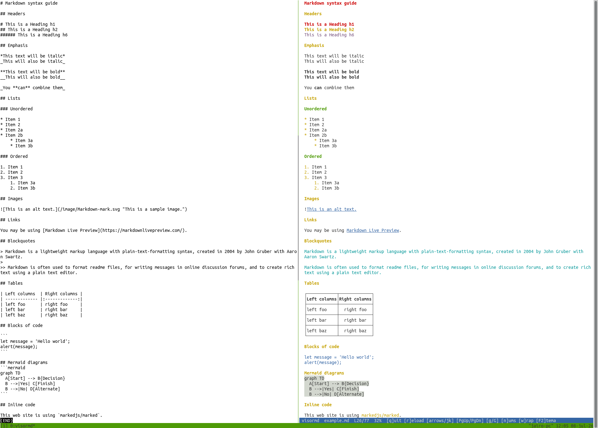

# VisorMD

A terminal-based interactive Markdown viewer written in C11 with ncursesw. It reads a Markdown file and displays it in a scrollable, syntax-highlighted terminal UI with vim-like keybindings.



*visorMD showing raw Markdown source (left) alongside its rendered output (right)*

## Features

- **Headings** (H1–H6) with distinct colors
- **Inline formatting** — bold (`**text**` / `__text__`), italic (`*text*` / `_text_`), `code`, and [links](https://example.com)
- **Tables** with box-drawing borders (`┌┬┐├┼┤└┴┘`), column alignment (`:---`, `:---:`, `---:`), and inline formatting inside cells
- **Code blocks** (fenced with ` ``` ` or `~~~`)
- **Blockquotes** (with nested `>>`, `>>>` support), horizontal rules, unordered and ordered lists
- **UTF-8 support** — emoji, CJK characters, and accented text with correct column width (via `wcwidth`)
- **9 color themes** — Default, Monochrome, Solarized Dark/Light, Nord, Gruvbox Dark, Dracula, One Light (white background), One Dark
- **Vim-like navigation** — `j`/`k`, `gg`/`G`, space/page-up/page-down
- **Smart word-wrap** — words stay whole when wrapping to the next line (togglable with `w`)
- **Responsive** — handles terminal resize, line wrapping, and proportional column scaling for wide tables

## Requirements

- **libncursesw** (wide-character ncurses)
- A UTF-8 locale (e.g., `C.UTF-8`, `en_US.UTF-8`)
- GCC or compatible C11 compiler

### Install dependencies

**Debian / Ubuntu:**
```bash
sudo apt install libncursesw5-dev
```

**Fedora:**
```bash
sudo dnf install ncursesw-devel
```

**Arch:**
```bash
sudo pacman -S ncurses
```

**macOS:**
```bash
brew install ncurses
```

## Build

```bash
make                  # Build the visormd binary
make clean            # Remove object files and binary
make install          # Install to /usr/local/bin
```

The binary is a standalone executable with no runtime dependencies beyond `libncursesw`.

## Usage

```bash
visormd [OPCIONES] [archivo.md]
```

| Option | Description |
|--------|-------------|
| `-c`, `--cat` | Dump rendered Markdown to stdout with ANSI colors and exit (no ncurses) |
| `-h`, `--help` | Show the help message |

Without options, the program starts in interactive mode with ncurses.

### Stdin support

VisorMD reads from stdin when no filename is given. Pipe/redirect works both in interactive mode and with `-c`:

```bash
cat README.md | visormd                           # pipe → modo interactivo
cat README.md | visormd -c                        # pipe → volcar a stdout
visormd -c < README.md                            # redirect con -c
echo "**bold**" | visormd                         # texto desde echo → interactivo
curl -s https://example.com/doc.md | visormd -c   # desde URL → stdout
```

When stdin is a pipe and interactive mode is used, the program reopens `/dev/tty` for keyboard input so ncurses works correctly. The `-c`/`--cat` flag is only needed when you want to dump the rendered output to stdout instead of opening the interactive viewer.

### Keybindings

| Key | Action |
|-----|--------|
| `q` | Quit |
| `r` | Reload the file from disk |
| `j` / `↓` | Scroll down one line |
| `k` / `↑` | Scroll up one line |
| Space / PgDn | Page down |
| `b` / PgUp | Page up |
| `g` / Home | Go to top |
| `G` / End | Go to bottom |
| `n` | Toggle line numbers |
| `w` | Toggle word-wrap (default: on, words stay whole) |
| `F2` | Open theme selector |

### Quick test

```bash
TERM=xterm-256color LANG=C.UTF-8 timeout 1 ./visormd test/test.md; echo "exit: $?"
```

## Architecture

```
File / stdin → TextBuffer (raw lines) → Parser (Document/ParsedLine/Spans) → Renderer (ncurses)
                                                                              → cat_renderer (stdout + ANSI)
```

- **`src/buffer.c`** — Reads a file or stdin into a dynamic array of raw UTF-8 strings (`buffer_load_file` / `buffer_load_stdin`).
- **`src/parser.c`** — Parses Markdown into a `Document` tree: classifies line types, extracts inline spans (`**bold**`/`__bold__`, `*italic*`/`_italic_`, code, links), parses nested blockquotes and table blocks with column alignment.
- **`src/renderer.c`** — ncursesw interactive viewer: renders spans with color attributes, handles line wrapping, scroll state, terminal resize, and the theme selector overlay.
- **`src/cat_renderer.c`** — Non-interactive stdout renderer used by `--cat`/`-c`: iterates the parsed document and emits plain text with ANSI escape codes (disabled when stdout is not a TTY).
- **`src/theme.c`** — 9 named color palettes with config persistence in `$HOME/.config/visormd/config` (respects `$XDG_CONFIG_HOME`).
- **`src/main.c`** — Entry point: argument parsing (filename, `-c`/`--cat`, `-h`), locale setup, auto-detects stdin pipe/redirect via `isatty()`, wires the pipeline, runs either the cat renderer or the interactive loop.

## Configuration

The selected theme is saved to `$XDG_CONFIG_HOME/visormd/config` (or `~/.config/visormd/config`). The file contains a single line:

```
theme=gruvbox
```

Available theme IDs: `default`, `monochrome`, `solarized-dark`, `solarized-light`, `nord`, `gruvbox`, `one-light`, `dracula`, `one-dark`.

## Table support

VisorMD renders GitHub-flavored pipe tables with full box-drawing borders:

```
┌──────────────────┬────────────────────────────────┐
│    Left align    │          Right align           │
├──────────────────┼────────────────────────────────┤
│ **bold**         │                       42.5    │
├──────────────────┼────────────────────────────────┤
│ *italic*         │                   `code`      │
└──────────────────┴────────────────────────────────┘
```

- Column alignment: `:---` (left), `:---:` (center), `---:` (right)
- Headers are centered and bold
- Inline formatting works inside cells
- Wide tables scale proportionally to fit the terminal
- Content that overflows is truncated with `…`

## Roadmap

Ideas for future improvements, roughly ordered by impact.

### High priority

- **Text search** — `/` to search, `n`/`N` for next/previous match. Highlight matches with `CP_HIGHLIGHT`, wrap around at end of document. Incremental search as the user types would make navigation in large documents much faster.

- **Configurable keybindings** — a `keybindings` file in `~/.config/visormd/` so users with non-US keyboards can remap keys. Support for combos like `Ctrl+D` / `Ctrl+U` (half-page scroll), `Ctrl+F` / `Ctrl+B` (full-page), and `0`/`$` (line start/end).

- **Checkboxes** — render `- [ ]` / `- [x]` as `☐` / `☑` (or `[ ]` / `[x]` with color). The parser already handles list detection; this extends `LINE_LIST_UNORDERED` with a new `SPAN_CHECKBOX` span type.

### Medium priority

- **Horizontal scroll** — `h`/`l` or `←`/`→` to pan left/right when table columns or code blocks overflow the terminal width. Show a `← more →` indicator in the status bar.

- **Heading outline** — press `t` to open a table-of-contents overlay (like the F2 theme selector). Shows H1–H6 indented; `Enter` jumps to that heading. Useful for navigating long documents.

- **Bookmarks** — `m<letter>` to set a mark at the current scroll position, `'<letter>` to jump back. Up to 26 bookmarks (a–z), lost on exit (or optionally persisted).

- **More light-background themes** — Paper, GitHub Light, Zen. The One Light theme already provides a solid base; adding variants is straightforward palette tweaking.

### Low priority

- **Multi-language syntax highlighting** — the parser currently only colors `bash` fenced blocks. Extend to `python`, `c`, `js`, `rust`, `json`, `yaml` with simple keyword-matching rules (no full AST needed for a terminal viewer).

- **Presentation mode** — `P` to enter slideshow mode where each H1/H2 becomes a full-screen slide centered vertically. `j`/`k` to navigate slides.

- **Recent files** — track the last ~10 opened files in config, accessible via `Ctrl+O` overlay.

- **Multiple file tabs** — `gt`/`gT` to cycle through open files. Each tab keeps its own scroll position.

- **Line number styles** — relative numbers (`:set rnu`), absolute (`:set nu`), or hybrid (current line absolute, others relative). The `n` key could cycle through modes.

- **Mouse support** — enable `ncurses` mouse events for scroll-wheel, click-to-position, and clickable links.

- **Hard-wrap paragraphs** — for `--cat` mode: reflow paragraphs to a fixed width (e.g. 72 columns) like `fmt -w 72`, independent of the terminal width.

## License

MIT
